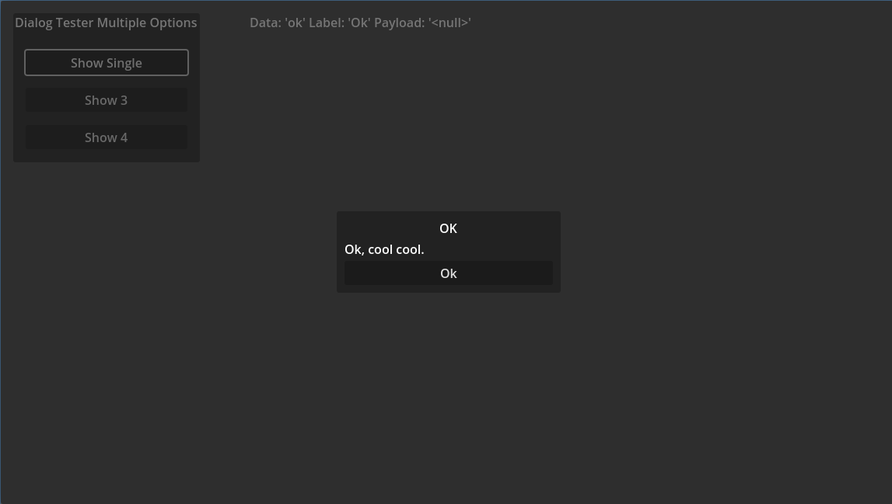
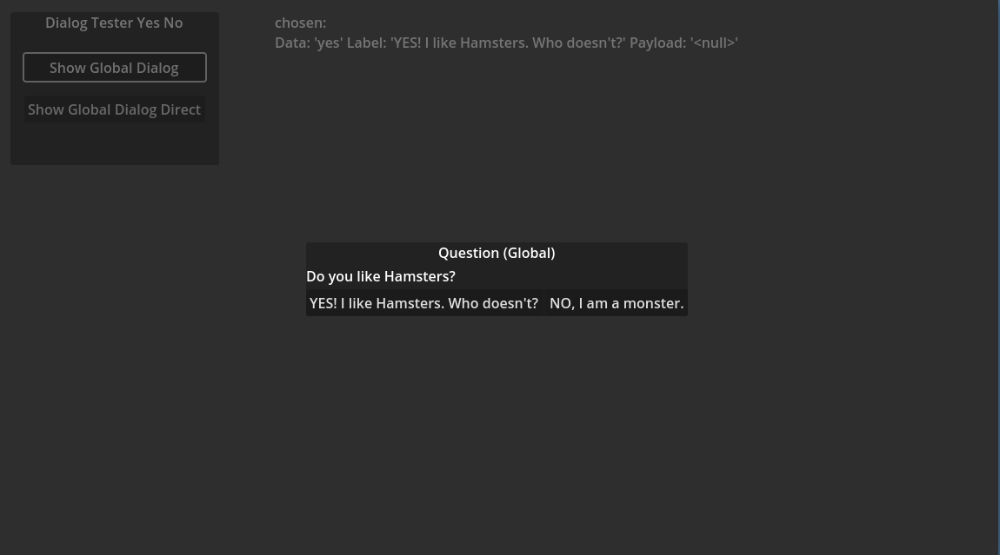
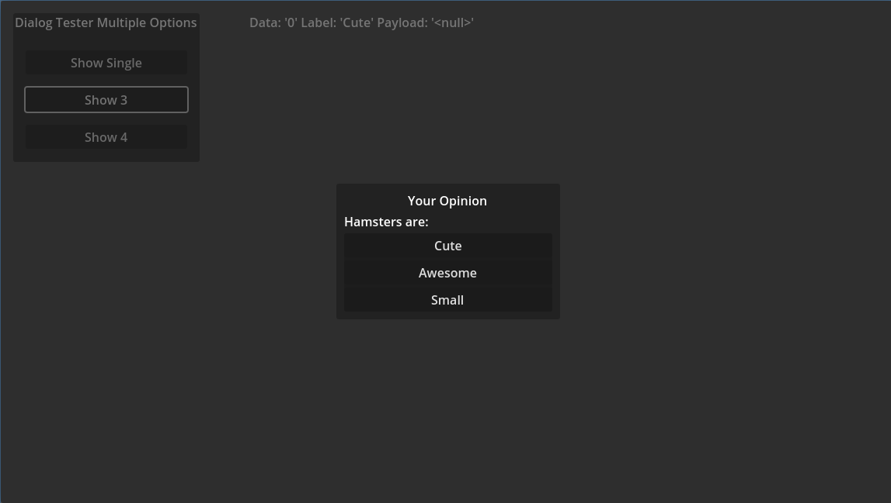
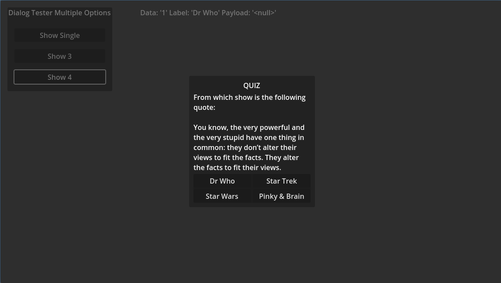
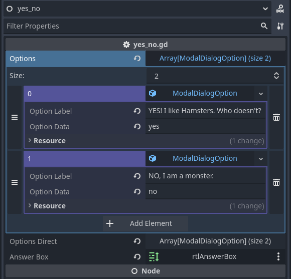

# ModalDialog
A modal dialog system for Godot.

## Features

* Title
* RichTextLabel for dialog text
* Options
	* are resources
	* can have direct function callbacks
	* string and any object payload per option
* Selection event that provides the chosen data
* Different layouts for options
* Signals per ModalDialogAutoWire node or code

## Screenshots


|  |  |
|  |  |

 

## Setup

To make ModalDialog globally available, set the `modal_dialog_global.tscn` scene global as `ModalDialogGlobal`.  
Under: Project -> Project Settings -> Globals

Path:  
```
ModalDialog/addons/ModalDialog/scenes/globals/modal_dialog_global.tscn
```

## TODO

* installer
	* set the global class automatically (needs dialog)
* icon
* more samplee scenes
	* lokal dialog
* more dynamic button layouts
* 100% UI-wiring without code

## Contribute
Please try to adhere to the GDScript style guidelines https://docs.godotengine.org/en/stable/tutorials/scripting/gdscript/gdscript_styleguide.html.  
States that are considered "stable" enough will get a git-tag and be released to the Godot Asset Library.  
In the future I'd like merge requests and development on the development branch, but since it's currently "moving fast" I don't care so much (yet).  

## OTHER
Godot Asset Library: -  
GitHub: https://github.com/SpielmannSpiel/ModalDialog  
by bison - SpielmannSpiel https://spielmannspiel.com  
